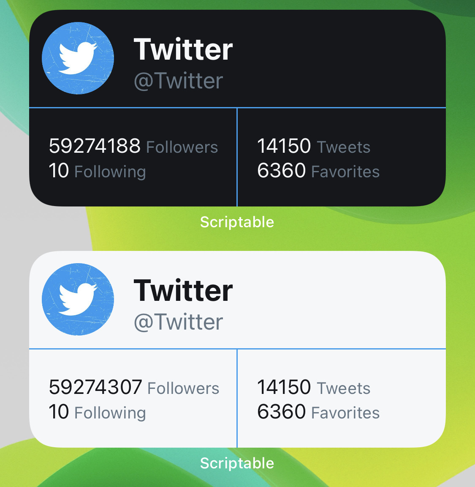
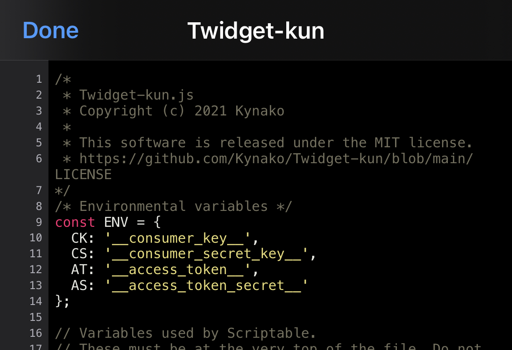
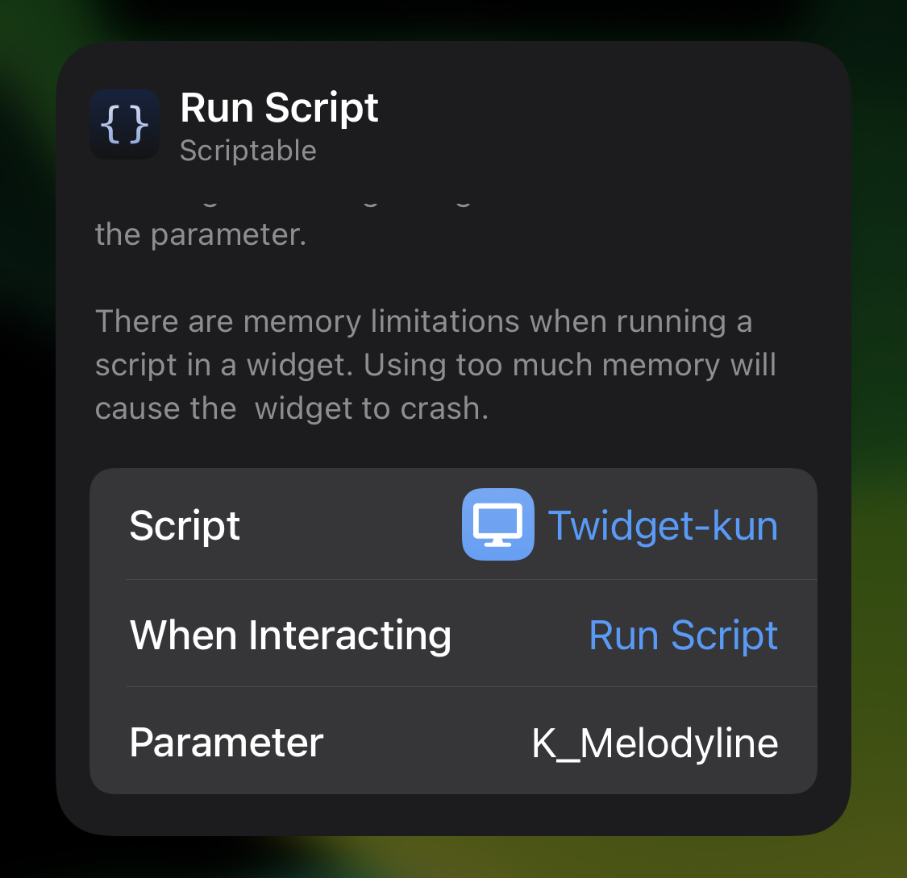

# Twidget-kun
A Twitter widget for Scriptable

# Overview

# Requirement
- Scriptable 1.6.3
- [Twista-js](https://github.com/Kynako/Twista-js)
- [cache](https://github.com/evandcoleman/scriptable/blob/main/scripts/cache.js)
- [CryptoJS](https://cryptojs.gitbook.io/docs/)

# How to start
## Set environmental variables

Set your API keys to `ENV` variable on line 9 to 14.

## Using on widget

You can designate a Twitter ID to show with widget’s parameter.

# License
[MIT license](LICENSE)
- Twista.js: [MIT license](https://github.com/Kynako/Twista-js/blob/main/LICENSE)
- cache.js: [MIT license](https://github.com/mvan231/Scriptable/blob/main/LICENSE)
- CryptoJS: [BSD license](https://code.google.com/archive/p/crypto-js/wikis/License.wiki)
